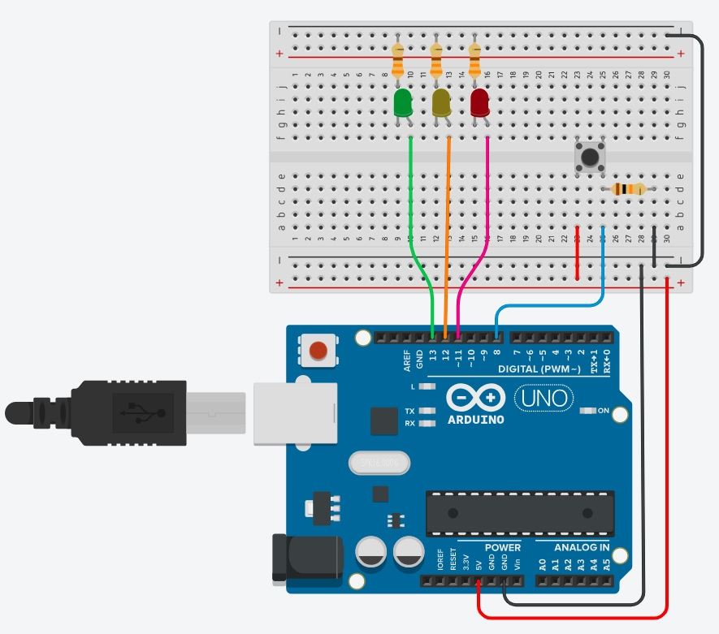

# 42-arduino-00

Antes de empezar vamos ver un sencillo simulador de circuitos **Tinkercard**

Y por supuesto, para aquellos que **no tienen conocimientos previos** de electrónica, es casi **obligatorio** revisar los recursos disponibles en el siguiente enlace :point_right: [link](https://github.com/fran-byte/electronica-para-principiantes)

### ¿Qué es Tinkercad?

**Tinkercad** es una herramienta en línea gratuita que permite a los usuarios diseñar y simular circuitos electrónicos y modelos 3D. Es especialmente popular entre los principiantes y educadores por su facilidad de uso y su capacidad para enseñar conceptos básicos de electrónica y diseño.

### Cómo acceder y registrarse en Tinkercad

1. **Acceder a Tinkercad y Registrate**:
   - Abre tu navegador web y ve a Tinkercad.
   - Haz clic en el botón "Únete ahora" o "Join Now".
   - Puedes registrarte usando tu cuenta de Google, Apple, o creando una cuenta nueva con tu correo electrónico.
   - Sigue las instrucciones para completar el registro.

### Cómo utilizar Tinkercad

1. **Iniciar sesión**:
   - Una vez registrado, inicia sesión con tus credenciales.

2. **Crear un nuevo proyecto**:
   - En el panel de control, selecciona "Crear nuevo" y elige entre "Diseño 3D" o "Circuitos".

3. **Diseñar circuitos**:
   - Si eliges "Circuitos", serás llevado a un área de trabajo donde puedes arrastrar y soltar componentes electrónicos como LEDs, resistencias, botones, y más.
   - Puedes conectar estos componentes usando cables virtuales y programar microcontroladores como el Arduino.

4. **Simular tu diseño**:
   - Una vez que hayas configurado tu circuito, puedes simular su funcionamiento haciendo clic en el botón "Iniciar simulación".
   - Observa cómo se comporta tu circuito y ajusta según sea necesario.

5. **Guardar y compartir**:
   - Guarda tu proyecto para futuras referencias o compártelo con otros usuarios.

### Ya estás listo para tu primer proyecto,
### espero que te pasaras por  links sobre electrónica y arduino 👉  [link](https://github.com/fran-byte/electronica-para-principiantes)


## ✅ Proyecto 1:

## Semáforo Básico con Botón (Tinkercad)

**Este primer ejercicio lo doy resuelto para facilitar el aprendizaje y poder ver tanto diseño del circuito como el codigo en c++ simplificado.**

**Nivel**: principiante
**Formato**: sin clases, lógica en loop() y funciones

### 💡 Idea:

Simular un cruce peatonal. El sistema se mantiene en verde para coches, pero si alguien pulsa el botón, después de un ciclo se cambia a rojo y deja pasar a los peatones.

### 🧩 Componentes:

3 LEDs (rojo, amarillo, verde)

3 resistencias limitadoras de corriente (220Ω o 330Ω para cada LED)

1 botón (con resistencia pull-down o usando INPUT_PULLUP)

Arduino Uno, o variantes. 



### 🛠️ Funcionalidad:

Estado por defecto: luz verde.

**Al pulsar el botón**: espera 2 segundos, cambia a amarillo por 1 segundo, luego a rojo por 5 segundos, y luego vuelve a verde.

El botón se ignora si ya está en proceso de cambio.

### :bookmark_tabs: Code:


```cpp
const int ledVerde = 13;
const int ledAmarillo = 12;
const int ledRojo = 11;
const int boton = 8;

// Estados del semáforo
enum Estado {
  VERDE_ON,           // Verde siempre encendido (estado inicial)
  ESPERAR_2_SEG,      // Espera 2 segundos después del botón
  AMARILLO_ON,        // Amarillo encendido (2 segundos)
  ROJO_ON             // Rojo encendido (5 segundos)
};

Estado estadoActual = VERDE_ON;
unsigned long tiempoInicio = 0;
bool botonPresionado = false;

void setup() {
  pinMode(ledVerde, OUTPUT);
  pinMode(ledAmarillo, OUTPUT);
  pinMode(ledRojo, OUTPUT);
  pinMode(boton, INPUT_PULLUP);

  // Estado inicial: Verde ON, otros OFF
  digitalWrite(ledVerde, HIGH);
  digitalWrite(ledAmarillo, LOW);
  digitalWrite(ledRojo, LOW);
}

void loop() {
  bool botonLeido = digitalRead(boton);

  // Detectar flanco ascendente (botón presionado)
  if (botonLeido == HIGH && estadoActual == VERDE_ON) {
    botonPresionado = true;
    tiempoInicio = millis();
    estadoActual = ESPERAR_2_SEG;
  }

  switch (estadoActual) {
    case VERDE_ON:
      // No hacer nada, el verde ya está encendido
      break;

    case ESPERAR_2_SEG:
      if (millis() - tiempoInicio >= 2000) {
        digitalWrite(ledVerde, LOW);      // Apagar verde
        digitalWrite(ledAmarillo, HIGH);  // Encender amarillo
        tiempoInicio = millis();
        estadoActual = AMARILLO_ON;
      }
      break;

    case AMARILLO_ON:
      if (millis() - tiempoInicio >= 2000) {  // 2 segundos en amarillo
        digitalWrite(ledAmarillo, LOW);      // Apagar amarillo
        digitalWrite(ledRojo, HIGH);          // Encender rojo
        tiempoInicio = millis();
        estadoActual = ROJO_ON;
      }
      break;

    case ROJO_ON:
      if (millis() - tiempoInicio >= 5000) {  // 5 segundos en rojo
        digitalWrite(ledRojo, LOW);          // Apagar rojo
        digitalWrite(ledVerde, HIGH);        // Volver a verde ON
        estadoActual = VERDE_ON;
        botonPresionado = false;            // Permitir nuevo ciclo
      }
      break;
  }

  delay(10); // Pequeña pausa para evitar rebotes del botón
}
```


### 🧠 Enfoque educativo:

Uso de digitalRead, digitalWrite, delay.

Estado controlado por variables (estado, espera).

Práctica de estructuras condicionales (if / case) y lógica secuencial.


---

## ✅ Proyecto 2:

## Termómetro con Alarma y Umbral Ajustable (Tinkercad)

**Nivel**: principiante–intermedio
**Formato**: sin clases, funciones separadas

### 💡 Idea:

Leer temperatura de un sensor (simulado) y activar una alarma (LED/buzzer) si supera cierto valor.

### 🧩 Componentes:

Sensor TMP36 o LM35 (simulado)

LED rojo (alarma)

1 resistencia (220Ω o 330Ω para el LED)

Potenciómetro (para ajustar el umbral)

Arduino Uno


### 🛠️ Funcionalidad:

Leer temperatura del sensor analógico.

Leer el umbral desde el potenciómetro.

Si la temperatura supera el umbral, se activa el LED.

Mostrar datos en consola serial (Serial.print).


### 🧠 Enfoque educativo:

Introducción a sensores analógicos (analogRead)

Conversión de valores (de ADC a °C)

Comparaciones, uso de map() para ajustar escala

Estructura del programa clara y segmentada en funciones: leerTemperatura(), leerUmbral(), activarAlarma().


---

## ✅ Proyecto 3:

## Detector de Luz Dual (con hardware real en Protoboard o simulador avanzado)

**Nivel**: intermedio
**Formato**: funciones + lógica más compleja

### 💡 Idea:

Un sistema con dos sensores de luz (LDRs) que "decide" hacia dónde girar o encender LEDs, según cuál detecta más luz.

### 🧩 Componentes:

2 LDRs con resistencias (divisor de voltaje)

2 LEDs (simulan motores, por ejemplo)

2 resistencias (220Ω o 330Ω para cada LED)

Arduino Uno, o similar. 


### 🛠️ Funcionalidad:

Se comparan las dos lecturas analógicas.

Si hay más luz en la izquierda, se enciende el LED izquierdo (o simula movimiento mediante un motor por ejemplo).

Si hay más en la derecha, se activa el otro.

Si es parejo, ambos apagados (o ambos encendidos tú decides).


### 🧠 Enfoque educativo:

Introducción al comportamiento reactivo.

Comparación de sensores.

Uso de funciones simples como compararLuz() o decidirMovimiento().

Se puede escalar fácilmente (se puede conectar a servos o motores reales más adelante).


---
